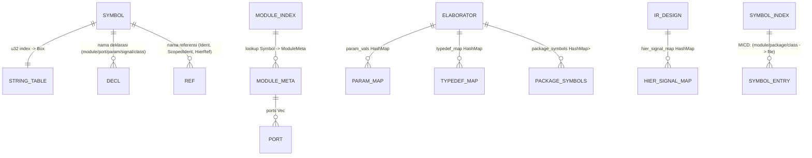

# Maria ERD

> Peta arsitektur / data-flow Maria — **reverse engineering langsung dari source code**.
> Setiap entity wajib punya bukti (file:line, symbol, function). Yang merupakan
> deduksi diberi label `Evidence: inferred`; yang ditemukan eksplisit diberi
> `Evidence: direct`. Bagian yang tidak dapat dipastikan diberi `Confidence: low`.
>
> Basis analisis: cabang `main` saat dokumen ini ditulis. Nomor baris mengacu
> pada kondisi working tree saat analisis dan dapat bergeser setelah edit.

---

## 1. Scope

Dokumen ini memetakan **entity, ownership, dependency, relationship, lifecycle,
persistence, dan aliran data** seluruh codebase Maria (RTL simulator
SystemVerilog + toolchain sintesis). Cakupan:

- 19 crate workspace + package binary `maria` (`src/main.rs`, `src/cli.rs`).
- Pipeline compiler: discovery → preprocess → lex → parse → AST → index →
  elaborasi → IR → simulasi / sintesis.
- MICD (Maria Incremental Compilation Database) dan lapisan cache pipeline.
- Arsitektur enterprise (`maria-env`: GlobalEnv + 12 context).
- Tooling CLI (11 tool), GUI (egui), formal verification, LSP, VPI, Maria HDL (`.mv`).

Tidak termasuk: test-only code sebagai arsitektur produksi (ditandai bila relevan),
artifact hasil run (`.vcd`/`.fst` di root repo), dan direktori third-party
(`opentitan/`, `cva6/`, `openc910/` — dipakai sebagai fixture uji).

**Status sintesis:** Phase 1–6 selesai (RTL→SIR→netlist→tech-map→timing→liberty);
Phase 7–9 belum (ASIC mapping, FPGA P&R penuh, incremental synthesis).

---

## 2. Codebase Map

```
Maria (workspace root, package binary `maria` + 19 crates)
├── src/                              ← CLI binary-only (migrasi monorepo selesai)
│   ├── main.rs                       ← entrypoint CLI, run()/run_fast(), dispatch tool
│   └── cli.rs                        ← MariaCmd enum + struct args per tool
├── crates/
│   ├── maria-core                    ← fondasi: Symbol, LogicVec/LogicVal, config, diagnostics, arena, checksum
│   ├── maria-ast                     ← AST: Design/Module/Port/Expr/Stmt/DataType + const_eval + inline
│   ├── maria-ir                      ← IR: IrDesign/IrModule/Process/IrStmt/IrExpr (serde utk MICD)
│   ├── maria-parser                  ← Preprocessor, Lexer, Parser (Pratt)
│   ├── maria-elaboration             ← Elaborator (AST→IR), const fold, generate, flatten, OptStats
│   ├── maria-compiler                ← CompileSession, MICD, cache pipeline, frontend (discovery/io/module_index), hir, scheduler
│   ├── maria-simulator               ← SimulationEngine, state, eval, scheduler, waveform, debugger, vpi, sdf, jit, uvm, parallel
│   ├── maria-mv                      ← bahasa Maria HDL (.mv) → transpile SV
│   ├── maria-formal                  ← FormalEngine (BMC + Z3, feature "formal")
│   ├── maria-sir                     ← SIR (RTL lowering) untuk sintesis
│   ├── maria-netlist                 ← Netlist generik 1-driver/N-load
│   ├── maria-synth                   ← SynthPipeline, pass optimizer, techmap, SYN check
│   ├── maria-timing                  ← STA (TimingReport), Constraint (.mcs), AreaReport
│   ├── maria-tech                    ← TechArch (generic/fpga), Liberty parser (.lib)
│   ├── maria-env                     ← GlobalEnv + 12 context, LSP, plugin
│   ├── maria-tools                   ← 11 CLI tool (minspect/mlint/melab/msim/mcov/mwave/mfmt/mprof/mcheck/mbench/synth)
│   ├── maria-gui                     ← GUI egui (bin maria-gui, feature "gui")
│   ├── maria-api                     ← API publik + re-export maria_* (compile_str/simulate_str/...)
│   └── maria-tests                   ← suite test terpadu
├── configs/*.toml                    ← konfigurasi (compiler/simulasi/coverage/debug)
├── test/ examples/                   ← fixture SV, golden artifact (mvnet, tech, rpt)
├── uvm_macros.svh                    ← macro UVM
└── .maria/database/                  ← MICD (runtime, tidak di-commit)
```

Dependency antar crate (dari `Cargo.toml` masing-masing):

```
maria-core ← maria-ast ← maria-ir
maria-ast ← maria-parser ← maria-elaboration ← maria-compiler
maria-ir ← maria-simulator (juga ← maria-parser/elaboration/compiler)
maria-core+ir ← maria-sir ← maria-netlist ← maria-timing ← maria-tools
maria-sir/netlist/tech ← maria-synth
maria-core ← maria-tech
maria-compiler/... ← maria-env ← maria-api ← maria-tools/tests/main
```

---

## 3. Entity Inventory

Tabel entity penting (Kind sesuai struktur aktual). `Lifecycle`: P=persistent (disk),
R=runtime (proses), S=session (per CompileSession), T=thread-local.

| Entity | Kind | Source (file:line) | Persistence | Owner | Lifecycle |
|--------|------|--------------------|-------------|-------|-----------|
| `Symbol` | struct (u32 interned) | `maria-core/src/intern/string_intern.rs:19` | — | Global `StringTable` | R (global, proses) |
| `StringTable` | struct (DashMap+RwLock) | `string_intern.rs:88` | — | global static | R |
| `LogicVal` | enum (0/1/X/Z) | `maria-core/src/logic.rs:112` | — | value type | R |
| `LogicVec` | struct (bits+width) | `logic.rs:25` | — | value type (sim state / AST) | R |
| `MariaConfig` | struct (TOML) | `maria-core/src/config.rs:19` | configs/*.toml | ConfigContext / CLI | P (file) + R |
| `Diagnostic` | struct | `diagnostics/diagnostic.rs:1070` | MICD diagnostics.mdb | DiagSink | R (+P via MICD) |
| `DiagSink` | struct (collector) | `diagnostic.rs:1260` | — | Parser/Elaborator/Engine | S |
| `DiagCode`/`DiagLevel` | enum | `diagnostic.rs:118` / `:44` | — | — | R |
| `TerminalEmitter` | struct | `diagnostics/emitter.rs:50` | — | CLI | R |
| `GlobalDiagnosticEngine` | struct | `diagnostics/global.rs:42` | — | global | R |
| `Design` (AST) | struct | `maria-ast/src/types.rs:11` | MICD objects/<hash>.ast | CompileSession.prev_designs | S + P |
| `Module` (AST) | struct | `types.rs:100` | dalam Design | Design | S + P |
| `Port` (AST) | struct | `types.rs:131` | dalam Design | Module | S + P |
| `ClassDecl` | struct | `types.rs:52` | dalam Design | Design | S + P |
| `PackageDecl` | struct | `types.rs:661` | dalam Design | Design | S + P |
| `Interface` | struct | `types.rs:121` | dalam Design | Design | S + P |
| `ModuleInstance` (AST) | struct | `types.rs:776` | dalam Design | Module | S + P |
| `GenerateBlock`/`GenerateItem` | struct/enum | `types.rs:603/608` | dalam Design | Module | S + P |
| `Expr` (AST) | enum | `maria-ast/src/expr.rs:4` | dalam Design | node pemilik | S + P |
| `Value` (AST literal) | enum | `expr.rs:128` | dalam Design | Expr | S + P |
| `Stmt` (AST) | enum | `maria-ast/src/stmt.rs:44` | dalam Design | node pemilik | S + P |
| `AlwaysBlock`/`SensitivityList` | struct | `stmt.rs:5/25` | dalam Design | Module | S + P |
| `IrDesign` | struct | `maria-ir/src/ir.rs:11` | MICD elaborate IR (bincode) | CompileSession / Engine | S + P |
| `IrModule` | struct | `ir.rs:161` | dalam IrDesign | IrDesign | S + P |
| `SignalInfo` | struct | `ir.rs:224` | dalam IrDesign | IrModule | S + P |
| `Process` (IR) | enum | `ir.rs:311` | dalam IrDesign | IrModule | S + P |
| `IrStmt` | enum | `ir.rs:406` | dalam IrDesign | Process | S + P |
| `IrExpr` | enum | `ir.rs:570` | dalam IrDesign | node pemilik | S + P |
| `IrInstance` | struct (Arc port/param map) | `ir.rs:288` | dalam IrDesign | IrModule | S + P |
| `IrClassDef`/`IrClassMethod` | struct | `ir.rs:87/127` | dalam IrDesign | IrDesign | S + P |
| `SignalId`/`ObjId`/`ClassId` | type alias (usize) | `ir.rs:8-9` | — | index semantics | R |
| `Preprocessor` | struct | `maria-parser/src/preprocessor.rs:24` | combined source di MICD | CompileSession (rayon) | S + P |
| `Token` | enum | `maria-parser/src/lexer.rs:5` | cache lexer/ (TokenRecord) | parser | S + P |
| `Lexer`/`FastLexer` | struct | `lexer.rs:397` / `maria-compiler/src/frontend/lexer.rs:15` | — | CompileSession | S |
| `Parser` | struct | `maria-parser/src/lib.rs:21` | cache parser/ | CompileSession | S |
| `Elaborator` | struct | `maria-elaboration/src/elaborator/mod.rs:214` | statistik → cache optimize/expression/ | CompileSession | S |
| `ElaborateMode` | enum | `elaborator/mod.rs:209` | — | caller | R |
| `OptStats`/`OptimizeSnapshot` | struct | `maria-elaboration/src/util/opt_stats.rs:20/74` | cache optimize/+expression/ | Elaborator | S + P |
| `CompileSession` | struct | `maria-compiler/src/frontend/compile_session.rs:72` | via MICD | CLI/GUI/tools | S |
| `SessionConfig` | struct | `compile_session.rs:34` | — | CompileSession | S |
| `SessionTiming` | struct | `compile_session.rs:117` | stats.mdb (profil) | CompileSession | S + P |
| `FileDiscovery`/`FileEntry` | struct | `frontend/discovery.rs:44/11` | — | CompileSession | S |
| `MmapFile` | struct | `frontend/io.rs:18` | — | per-file borrow | S |
| `ModuleIndex`/`ModuleMeta` | struct | `frontend/module_index.rs:41/9` | symbol.mdb (turunan) | CompileSession | S + P |
| `CacheManager` | struct | `cache/cache_manager.rs:239` | in-memory (+remote opsional) | CompileSession | S |
| `CacheKey`/`CacheStore` | enum/struct | `cache_manager.rs:21/81` | — | CacheManager | S |
| `AstCache`/`HirCache`/`DepCache` | struct | `cache/ast_cache.rs:13`, `hir_cache.rs:10`, `dep_cache.rs:14` | — | CacheManager | S |
| `FilesystemCache` | struct | `cache/remote.rs:198` | disk (remote cache) | CacheManager | P (opsional) |
| `MicdDatabase` | struct (object DB) | `micd/mod.rs:152` | `.maria/database/` | CompileSession.micd | P |
| `FileMeta`/`FileStatus` | struct/enum | `micd/metadata.rs:27/14` | state/<pid>/metadata.mdb | MicdDatabase | P |
| `FileGraph` | struct | `micd/graph.rs:16` | graph.mdb | MicdDatabase | P |
| `VerifyResult`/`CheckResult` | struct | `micd/verify.rs:86/56` | verify.mdb | MicdDatabase | P |
| `SymbolIndex` | struct | `micd/symbol.rs:19` | symbol.mdb | MicdDatabase | P |
| `DiagEntry`/`FileDiags` | struct | `micd/diag.rs:67/104` | diagnostics.mdb | MicdDatabase | P |
| `Snapshot` | struct | `micd/snapshot.rs:31` | snapshots/build-NNN | MicdDatabase | P |
| `StatsDb`/`BuildProfile` | struct | `micd/stats.rs:46/14` | stats.mdb | MicdDatabase | P |
| `Journal` | struct | `micd/txn.rs:32` | journal.mdb | MicdDatabase | P |
| `MdbWriter`/`MdbReader` | struct | `micd/format.rs:156/305` | format MDB1 | MicdDatabase | P |
| `CacheLayer` | struct | `micd/cache/mod.rs:61` | cache/<pid>/<category>/ | MicdDatabase.cache_layer | P |
| `CacheCategory` | enum (21 kategori) | `micd/cache/category.rs:18` | — | CacheLayer | P |
| `SimulationEngine` | struct | `maria-simulator/src/simulator/engine/mod.rs:90` | — (state R) | CLI/GUI/tools | R |
| `SimulationLimit` | enum | `engine/mod.rs:57` | — | Engine | R |
| `SimulationState` | struct | `simulator/state.rs:12` | cache simulation/ (ringkasan) | Engine | R |
| `SimulationArena`/`ArenaGuard` | struct | `simulator/arena.rs:84/58` | — | Engine (thread-local ctor) | R |
| `RegionEvent`/`EventKind`/`EventRegion` | struct/enum | `simulator/types.rs:122/82/89` | — | Engine.events | R |
| `ForkGroup`/`Continuation`/`FlowControl` | struct/enum | `types.rs:161/174/182` | — | Engine | R |
| `Breakpoint`/`Watchpoint`/`StateSnapshot` | enum/struct | `types.rs:23/44/74` | — | Debugger/Engine | R |
| `Debugger` | struct | `maria-simulator/src/debugger/mod.rs:9` | — | CLI --debug | R |
| `VcdWriter` | struct | `waveform/vcd.rs:8` | `<top>.vcd` | Engine | P (artifact) |
| `FstWaveWriter` | struct | `waveform/fst.rs:11` | `<top>.fst` | Engine | P (artifact) |
| `CsvWaveWriter` | struct | `waveform/csv.rs:17` | `.csv` | Engine | P (artifact) |
| `SignalStats` | struct | `waveform/statistics.rs:39` | — | Engine | R |
| `SimulationDag` | struct | `scheduler/sim_dag.rs:341` | — | engine (analisis) | R |
| `ClockDomainAnalysis`/`CdcAnalysis` | struct | `scheduler/clock_domain.rs:54` / `cdc.rs:150` | — | engine/tool | R |
| `GlobalEnv` | struct (12 Arc context) | `maria-env/src/env/global/global_env.rs:21` | — | CLI (for_cli) | R (proses) |
| `ConfigContext` | struct | `maria-env/src/env/config/config.rs:28` | config | GlobalEnv | R |
| `WorkspaceContext` | struct | `maria-env/src/env/workspace/workspace.rs` | — | GlobalEnv | R |
| `CompilerContext` | struct | `maria-env/src/env/compiler/compiler.rs:14` | — | GlobalEnv | R |
| `DatabaseContext` | struct | `maria-env/src/env/database/database.rs:9` | MICD | GlobalEnv | R |
| `CacheContext` | struct | `maria-env/src/env/cache/cache.rs:6` | .maria/cache | GlobalEnv | R |
| `SimulationContext`/`SimulationKernel` | struct | `maria-env/src/env/simulation/simulation.rs:8` / `kernel.rs:26` | — | GlobalEnv | R |
| `SirModule`/`SirNode`/`SirRegister` | struct | `maria-sir/src/sir.rs:208/148/179` | dump SIR (.sir text) | synth | S + P |
| `Netlist` | struct | `maria-netlist/src/net.rs:60` | `.mvnet`/`netlist.v`/`.json` | synth | P |
| `CellInstance`/`CellKind` | struct/enum | `maria-netlist/src/cell.rs:218/44` | dalam Netlist | Netlist | P |
| `SynthPipeline`/`SynthPass` | struct/trait | `maria-synth/src/pass.rs:54/48` | — | synth tool | S |
| `TechMapResult` | struct | `maria-synth/src/techmap.rs:228` | `.tech.v/.json/.mvnet` | synth | P |
| `SynCheck` | struct | `maria-synth/src/subset.rs:38` | — | synth | S |
| `TimingReport`/`Endpoint` | struct | `maria-timing/src/timing.rs:81/53` | `<top>.timing.rpt` | synth --timing | P |
| `Constraint`/`ClockSpec` | struct | `maria-timing/src/constraint.rs:40/22` | `.mcs` | synth --constraint | P (input) |
| `AreaReport` | struct | `maria-timing/src/area.rs:21` | `<top>.area.rpt` | synth | P |
| `LibertyLibrary`/`LibertyCell` | struct | `maria-tech/src/liberty.rs:109/78` | `.lib` → `.libmdb` | synth asic | P |
| `TechArch` trait | trait | `maria-tech/src/arch.rs:21` | — | synth | R |
| `MariaApp` | struct (egui) | `maria-gui/src/app.rs:25` | state serde? (gui) | bin maria-gui | R |
| `FormalEngine` | struct | `maria-formal/src/lib.rs:60` | — | `--equiv`/BMC | R |
| `mv::Expr`/`mv::Stmt` (Maria HDL) | enum | `maria-mv/src/ast.rs:41/126` | — | transpile | S |
| LSP backend | module | `maria-env/src/lsp/backend.rs` | — | feature "lsp" | R |

> Entity bertipe "dalam Design/IrDesign" di-persist secara agregat (satu blob
> bincode per file AST / satu blob IrDesign per top), bukan per-node.

---

## 4. Core ERD

Entity yang **dapat dibuktikan** dari kode (nama → simbol di tabel §3).
Cardinality dari struktur field aktual (HashMap/Vec/Option).

```mermaid
erDiagram
    PROJECT ||--o{ SOURCE_FILE : "registry.sources (ProjectInfo)"
    SOURCE_FILE ||--|| PREPROCESS_RESULT : "Preprocessor.preprocess -> combined"
    SOURCE_FILE ||--o{ TOKEN_STREAM : "Lexer/FastLexer (per file)"
    SOURCE_FILE ||--|| AST : "Parser.parse_design (per file, rayon)"
    AST ||--o{ MODULE : "design.modules Vec"
    AST ||--o{ PACKAGE : "design.packages Vec"
    AST ||--o{ INTERFACE : "design.interfaces Vec"
    AST ||--o{ CLASS : "design.classes Vec"
    MODULE ||--o{ PORT : "module.ports Vec"
    MODULE ||--o{ MODULE_ITEM : "module.items Vec"
    MODULE_ITEM ||--o{ MODULE_INSTANCE : "Instance(inst)"
    MODULE ||--o{ GENERATE_BLOCK : "Generate(gen)"
    MODULE ||--o{ EXPRESSION : "Expr node tree"
    MODULE ||--o{ STATEMENT : "Stmt node tree (always/initial/final)"
    MODULE o{--o{ MODULE : "dependency (inst graph, generate-aware)"
    AST ||--|| MODULE_INDEX : "ModuleIndex.insert per module"
    COMPILE_SESSION ||--o{ AST : "prev_designs HashMap<PathBuf,Design>"
    COMPILE_SESSION ||--|| CACHE_MANAGER : "self.cache"
    COMPILE_SESSION ||--o| MICD_DATABASE : "self.micd Option"
    MICD_DATABASE ||--o{ FILE_META : "files HashMap<PathBuf,FileMeta>"
    MICD_DATABASE ||--|| FILE_GRAPH : "graph FileGraph"
    MICD_DATABASE ||--o{ AST_OBJECT : "objects/<pid>/<hash>.ast (CAS)"
    MICD_DATABASE ||--o{ PREPROC_OBJECT : "objects/<pid>/<hash>.preproc"
    MICD_DATABASE ||--o{ VERIFY_RESULT : "verify HashMap<u64,VerifyResult>"
    MICD_DATABASE ||--|| SYMBOL_INDEX : "symbols"
    MICD_DATABASE ||--o{ DIAG_ENTRY : "diags HashMap<PathBuf,FileDiags>"
    MICD_DATABASE ||--o{ SNAPSHOT : "snapshots Vec<u64>"
    MICD_DATABASE ||--o| CACHE_LAYER : "cache_layer Option"
    CACHE_LAYER ||--o{ CACHE_CATEGORY : "21 kategori (lexer/parser/elaborate/...)"
    AST ||--|| ELABORATOR : "Elaborator.design"
    ELABORATOR ||--o{ IR_MODULE : "modules HashMap<Symbol,IrModule>"
    IR_MODULE ||--|| IR_DESIGN : "IrDesign.top (top module)"
    IR_DESIGN ||--o{ IR_MODULE : "IrDesign.modules HashMap"
    IR_DESIGN ||--o{ CLASS_DEF : "IrDesign.classes (IrClassDef)"
    IR_MODULE ||--o{ SIGNAL : "signals Vec<SignalInfo>"
    IR_MODULE ||--o{ PROCESS : "processes Vec<Process>"
    IR_MODULE ||--o{ INSTANCE : "sub_instances Vec<IrInstance>"
    PROCESS ||--o{ IR_STMT : "body Vec<IrStmt>"
    IR_STMT ||--o{ IR_EXPR : "expression tree"
    IR_DESIGN ||--o{ HIER_SIGNAL_MAP : "hier_signal_map Symbol->SignalId"
    COMPILE_SESSION ||--|| IR_DESIGN : "cached_ir_design / compile_and_elaborate"
    SIMULATION_ENGINE ||--|| IR_DESIGN : "engine.design"
    SIMULATION_ENGINE ||--|| SIMULATION_STATE : "engine.state"
    SIMULATION_STATE ||--o{ SIGNAL_VALUE : "signals Vec<LogicVec> indexed SignalId"
    SIGNAL ||--|| SIGNAL_VALUE : "SignalInfo.idx -> LogicVec"
    SIMULATION_ENGINE ||--o{ REGION_EVENT : "events Vec<Vec<RegionEvent>>"
    SIMULATION_ENGINE ||--o| WAVEFORM : "vcd/fst/csv Option"
    WAVEFORM ||--o{ ARTIFACT : "VCD/FST/CSV file"
    GLOBAL_ENV ||--o{ ENV_CONTEXT : "12 Arc context (config/workspace/compiler/...)"
    ENV_CONTEXT ||--o| COMPILE_SESSION : "CompilerContext wraps CompileSession"
    IR_DESIGN ||--|| SIR_MODULE : "maria-sir lowering (LowerResult)"
    SIR_MODULE ||--o{ SIR_NODE : "SirNode DAG"
    SIR_MODULE ||--|| NETLIST : "maria-netlist lowering"
    NETLIST ||--o{ CELL_INSTANCE : "CellInstance DAG"
    SYNTH_PIPELINE ||--o{ NETLIST : "optimizes (pass manager)"
    NETLIST ||--o| TIMING_REPORT : "STA (maria-timing)"
    NETLIST ||--o| AREA_REPORT : "area analysis"
    LIBERTY_LIBRARY ||--o{ LIBERTY_CELL : "liberty.rs parser (.lib)"
```

**Catatan cardinality:** `INSTANCE ||--o{ IR_MODULE` tidak digambar karena
`IrInstance.module_name` adalah Symbol (nama), bukan referensi objek — resolusi
ke `IrModule` dilakukan via `IrDesign.modules` lookup pada elaborasi/flatten.

---

## 5. Ownership Model

Pola ownership aktual (dari field/container):

| Entity | Created By | Owned By | Mutated By | Persisted By | Invalidated By |
|--------|-----------|----------|------------|--------------|----------------|
| `Symbol` | `StringTable.intern` | global static (append-only) | — (immutable) | diserialisasi sbg string | `reset_string_table()` (daemon) |
| `LogicVec` | heap / `SimulationArena` ctor (thread_local `LOGICVEC_CTOR`) | nilai (pemilik field) | eval engine | — (in-MICD sbg bagian IR) | arena reset / drop |
| `Design` (AST) | `Parser.parse_design` (per file, rayon) | `CompileSession.prev_designs` (HashMap, clone utk cache) → merge → `Elaborator.design` | elaborator (tidak mengubah AST, membaca) | MICD `serialize_design` (bincode) | `clear_cache()` / compile baru |
| `IrDesign` | `Elaborator.elaborate` / MICD `restore_elaborate_ir` | `CompileSession.cached_ir_design` → dipindah ke `SimulationEngine.design` | engine (membaca) | MICD `store_elaborate_ir` (bincode) | compile baru / `clear_cache()` |
| `MicdDatabase` | `MicdDatabase::open*` (CLI, main.rs:702-716) | `CompileSession.micd` (Option) | `save_micd`, `attach_micd` | dir `.maria/database/` | `clear_cache()`, GC, schema bump |
| `CacheLayer` | `MicdDatabase` (best-effort) | `MicdDatabase.cache_layer` | `CachePopulator` + tools (`put`/`get`) | `cache/<pid>/` | `run_gc`, `--cache-clear` |
| `SimulationState` | `SimulationState::new(&IrDesign)` | `SimulationEngine.state` | engine (scheduler/eval) | ringkasan → cache simulation/ | end simulasi |
| `GlobalEnv` | `for_cli` / `GlobalEnv::minimal` | main.rs | context accessor | — | `env::shutdown` |
| `Netlist`/`CellInstance` | `maria-netlist` lowering | tool synth (struct) | pass optimizer | `.mvnet`/`netlist.v`/`.json` | run ulang synth |

Pola tersembunyi:
- **`Arc`**: `IrInstance.port_map/param_map/type_param_map` (`ir.rs:288`) — dibagi antar flatten; `GlobalEnv` ke-12 context (`global_env.rs:21`); `RemoteCacheBackend` di `CacheManager`.
- **`RefCell`**: `Elaborator.specialized_classes`, `source_name_loc`, `inline_func_pkg` — mutasi interior di method `&self`.
- **`Mutex`**: `CompileSession.combined_parts`, `lexer_payloads` (koleksi lintas rayon); `CacheStore` (LRU list).
- **`RwLock`**: `StringTable.strings` (read-heavy `as_str`).
- **`DashMap`**: `StringTable.lookup` (intern O(1)); `ModuleIndex` (per DESIGN.md; aktual `HashMap` + `Mutex`? — verifikasi §27).
- **`Cell`**: `OptStats` counters (`opt_stats.rs:20`) — increment dari `&self`.
- **Thread-local**: `LOGICVEC_CTOR` (`logic.rs:15`) — alokasi LogicVec dari arena per thread.

---

## 6. Compiler Pipeline Data Model

Pipeline aktual (dari `CompileSession::compile` + `run`/`run_fast` di main.rs):

```
SOURCE_FILE → FileDiscovery → Preprocessor (rayon, per file)
   → Lexer/FastLexer (rayon) → TOKEN_STREAM (global line offset)
   → Parser (rayon, per file) → AST (Design per file)
   → merge (extend_design_move) → MODULE_INDEX + DependencyGraph + IncrementalTracker
   → Elaborator (AST→IR: const fold, generate, flatten, param resolve)
   → IR_DESIGN
   → SimulationEngine → WAVEFORM (VCD/FST/CSV)   [jalur simulasi]
   → maria-sir → SIR → SynthPipeline → Netlist → techmap/timing  [jalur sintesis]
```

Per stage:

| Stage | Input | Output | State | Cache | Error | Persistence |
|-------|-------|--------|-------|-------|-------|-------------|
| Discovery | sources/incdirs (`SessionConfig`) | `Vec<PathBuf>` | `SessionTiming.discovery_ms` | — | ModuleNotFound | — |
| Preprocess | source bytes (mmap / inline `.mv`) | combined source (`PreprocEntry`) | include deps | MICD `objects/<hash>.preproc` | InvalidSyntax | P |
| Lex | combined source | `Vec<(Token,line,col)>` | `lexer_payloads` | MICD cache `lexer/` | — | P |
| Parse | tokens | `Design` per file | `parser.errors` (DiagSink) | MICD `objects/<hash>.ast` | parse error → SimError | P |
| Index | designs | `ModuleIndex` + `DependencyGraph` | `timing.index_ms` | MICD symbol.mdb | — | P (turunan) |
| Elaborate | merged `Design` | `IrDesign` | `Elaborator` maps + `OptStats` | MICD IR (bincode) + cache `elaborate/` `optimize/` `expression/` | elab error → SimError | P |
| Simulate | `IrDesign` | VCD/FST/CSV + coverage | `SimulationState` | cache `simulation/` `waveform/` `coverage/` | runtime error | P (artifact) |
| Synthesize | `IrDesign` | `.mvnet`/`.tech.v`/`timing.rpt` | `SynthContext` | — | SYN check | P |

Jalur ganda: `run` (main.rs:535) = elaborasi penuh + MICD parse cache; `run_fast`
(main.rs:2046) = restore penuh AST **dan** IR (`restore_elaborate_ir`,
main.rs:2235) sehingga elaborator bisa di-skip.

---

## 7. AST / HDL Data Model

`Design` (types.rs:11) menampung Vec: `modules`, `packages`, `interfaces`,
`classes`, `binds`, `clocking_blocks`, `configs`, `udp_defs`, `unit_imports`,
`unit_funcs`, `unit_tasks`, `unit_typedefs`, `unit_params`, `unit_decls`.

```mermaid
erDiagram
    DESIGN ||--o{ MODULE : modules
    DESIGN ||--o{ PACKAGE : packages
    DESIGN ||--o{ INTERFACE : interfaces
    DESIGN ||--o{ CLASS : classes
    DESIGN ||--o{ TYPEDEF : typedefs
    DESIGN ||--o{ COVERGROUP : covergroups
    DESIGN ||--o{ DPI_IMPORT : dpi_imports
    DESIGN ||--o{ UDP : udp_defs
    DESIGN ||--o{ SPECIFY : specify_items
    MODULE ||--o{ PORT : ports
    MODULE ||--o{ PARAM : params
    MODULE ||--o{ DECL : "decls (DeclKind)"
    MODULE ||--o{ MODULE_ITEM : items
    MODULE_ITEM ||--o{ INSTANCE_AST : Instance
    MODULE_ITEM ||--o{ GENERATE : Generate
    MODULE_ITEM ||--o{ IMPORT : Import
    MODULE_ITEM ||--o{ ALWAYS : AlwaysBlock
    MODULE_ITEM ||--o{ INITIAL : InitialBlock
    MODULE_ITEM ||--o{ CONTINUOUS : ContinuousAssign
    MODULE ||--o{ TASK : TaskDecl
    MODULE ||--o{ FUNCTION : FunctionDecl
    CLASS ||--o{ CLASS_MEMBER : members
    INSTANCE_AST ||--o{ PORT_CONNECTION : port map
    GENERATE ||--o{ GENERATE_ITEM : "items (If/For/Case)"
    ALWAYS ||--|| SENSITIVITY : SensitivityList
    ALWAYS ||--o{ STMT : body
    STMT ||--o{ EXPR : expressions
    PORT ||--o| INIT_EXPR : "Port.init_expr (ANSI = expr)"
    PARAM ||--o| DEFAULT_EXPR : "ParamDecl.default"
```

Lapisan (dibedakan tegas):
- **AST node** — `Expr`/`Stmt`/`Module`/`Design` (maria-ast), immutabel.
- **Resolved node** — const-eval `const_eval_with_params` (const_eval.rs:50),
  type resolution `DataType` (types.rs:438), import package resolve.
- **Elaborated node** — `IrExpr`/`IrStmt`/`Process` (maria-ir) dengan `SignalId`
  sudah berupa index.
- **Runtime object** — `ObjectData` (`ir.rs:97`), `SimulationState.objects`,
  UVM data (`UvmObjectData` dst. types.rs:197+).

Perbedaan penting: AST memakai `Symbol` (interned), IR memakai `SignalId`
(index flat); hierarki `HierRef(Symbol)` tetap ada di IR untuk referensi yang
baru di-resolve saat runtime (`IrLValue::HierRef`, `IrExpr::HierRef`).

---

## 8. Symbol / Name Resolution Model



Mekanisme resolusi aktual:
- **Intern**: `Symbol::intern` → `StringTable` (DashMap O(1), `string_intern.rs:19/88`).
  Hash Symbol = hash u32 index (bukan string) — semua lookup map wajib pakai
  `Symbol::intern` dulu (dokumentasi eksplisit di `string_intern.rs`).
- **Global type name seeding**: parser menerima `with_global_type_names`
  (lib.rs:124) — nama class/typedef lintas file di-scan dari combined source
  agar `ClassType var;` tidak salah parse sebagai instance.
- **Package**: `pkg::name` → `pkg_const_scalars`/`pkg_param_ctx`
  (elaborator), `import pkg::*` → `unit_import_ctx`.
- **Hierarki**: nama `inst.sig` → `IrExpr::HierRef` → engine resolve via
  `IrDesign.hier_signal_map` saat flatten (ir.rs:11).
- **Duplicate/shadowing**: tidak ada registry scope eksplisit — resolusi
  dilakukan elaborator per-module (scoping implisit). Unresolved → diagnostic
  (mis. `'X' not found in parameter context`, elaborator `source_name_loc`).

**Kepemilikan:** `Symbol` milik tabel global; `ModuleIndex` milik
`CompileSession`; map-map elaborator milik `Elaborator` (session);
`SymbolIndex` (MICD) milik `MicdDatabase` (persistent).

---

## 9. Type System Model

Tipe yang benar-benar ada di codebase:

- **AST type**: `DataType` enum (types.rs:438) — base (`logic`/`wire`/`reg`/
  `int`/`bit`/`byte`/`shortint`/`longint`/`real`/`time`/`string`), UserDefined
  (typedef/class/interface), array/struct/enum/union, packed dims.
- **Range**: `Range`/`ExprRange` (types.rs:176/255) — `[msb:lsb]` termasuk
  ekspresi parameter.
- **IR type**: `SignalInfo` (ir.rs:224) — `width`, `msb/lsb`, `array_dims`,
  `packed_dims`, `elem_width`, `is_signed`, `is_2state`, `class_name`,
  `iface_type/iface_modport`, `struct_fields` (`StructFieldInfo`, ir.rs:206).
- **Typedef resolution**: `Elaborator.typedef_map`, `typedef_field_map`,
  `typedef_dims` (elaborator/mod.rs) — `UserDefined` → field struct + packed dims.
- **Const eval**: `const_eval_with_params` (const_eval.rs:50) + `CVal`/`Scalars`
  (`maria-ast::const_eval_ext`) — evaluasi param default, enum member, struct.
- **Type index (MICD)**: `MicdDatabase.type_index: HashMap<String,u64>` — module
  → signature hash (types.mdb).

```mermaid
erDiagram
    DATATYPE ||--o{ RANGE : packed dims
    DATATYPE ||--o| TYPEDEF : UserDefined -> TypedefDecl
    TYPEDEF ||--o{ STRUCT_FIELD : typedef_field_map
    SIGNAL ||--|| DATATYPE : SignalInfo carries resolved shape
    SIGNAL ||--o{ STRUCT_FIELD : struct_fields (nested)
    TYPEDEF_MAP ||--o{ TYPEDEF : Elaborator.typedef_map Symbol->idx
    ELABORATOR ||--o{ TYPE_INDEX : MICD types.mdb (signature hash)
```

Tidak ada `TypeId`/`TypeRef`/`TypeConstraint` eksplisit — representasi tipe
adalah `DataType` (AST) yang di-flatten ke metadata `SignalInfo` (IR).
**Status: tidak ditemukan** `Generic`/parameterized-type system terpisah
(parameterized class via `IrTypeParam`, ir.rs:82).

## 10. Elaboration Data Model

```mermaid
erDiagram
    ELABORATOR ||--|| DESIGN : input (merged AST)
    ELABORATOR ||--o{ IR_MODULE : modules
    ELABORATOR ||--o{ PARAM_VALS : param_vals (Symbol->i64)
    ELABORATOR ||--o{ PACKAGE_SYMBOLS : package context
    ELABORATOR ||--o{ MODULE_CACHE : "module_cache HashMap<u64,IrModule> (signature)"
    IR_MODULE ||--o{ IR_INSTANCE : sub_instances
    IR_INSTANCE ||--o{ PORT_MAP : "Arc<HashMap<Symbol,SignalId>>"
    IR_INSTANCE ||--o{ PARAM_MAP : "Arc<HashMap<Symbol,i64>>"
    IR_MODULE ||--o{ PROCESS : processes
    PROCESS ||--o| CLOCK_EDGE : Sequential clock
    PROCESS ||--o| RESET_INFO : Sequential reset
    ELABORATOR ||--o| IFACE_ALIAS : iface_alias_jobs (flatten)
```

Mekanisme aktual:
- **Module instantiation**: `IrInstance` (`ir.rs:288`) — port binding
  `port_map: Arc<HashMap<Symbol, SignalId>>`, param override `param_map`.
- **Parameter resolve**: `param_vals` + `pkg_param_ctx` (cache global package).
- **Generate**: `GenerateBlock` → ekspansi saat elaborasi; statistik
  `OptStats.loop_unrolls` (cache `generate/`).
- **Hierarchy**: `flatten_instances` (elaborator/flatten.rs) → `hier_signal_map`
  (Symbol → SignalId) + `Process` di top; interface instance → handle.
- **Scope creation**: tidak ada scope object eksplisit — scope = maps milik
  `Elaborator` + `current_module` (Symbol). Instance ID tidak ada; instance
  dirujuk via `instance_name: Symbol`.
- **Elaborate cache**: `module_cache: HashMap<u64, IrModule>` (session) +
  MICD `restore_elaborate_ir` (lintas run).

## 11. MICD Data Model

Layout aktual (dokumentasi `micd/mod.rs` header + konstanta `DB_*`/`DIR_*` di `micd/mod.rs:76-95`):

```
<db>/                        (default .maria/database, override MARIA_MICD_DIR)
    VERSION                  SCHEMA_VERSION = 4
    registry.json            pid -> ProjectInfo (root, sources, times)
    locks/<pid>.lock         writer lock (WriteLock)
    objects/<pid>/           payload IMMUTABLE, content-addressed (CAS)
        <hash>.ast           Design bincode per content hash (dedup)
        <hash>.preproc       combined source per content hash
    state/<pid>/             index MUTABLE per project
        metadata.mdb         FileMeta per file
        graph.mdb            FileGraph (CSR + reverse index)
        verify.mdb           VerifyResult by content hash
        diagnostics.mdb      DiagEntry per file
        symbol.mdb           SymbolIndex
        types.mdb            module -> signature hash
        stats.mdb            StatsDb (BuildProfile, peak RSS)
        journal.mdb          Journal (crash recovery)
        snapshots/build-NNN  Snapshot (rollback)
    cache/<pid>/<category>/  CacheLayer (21 kategori, db.md 1141-1605)
```

```mermaid
erDiagram
    MICD_DATABASE ||--o{ FILE_META : files
    FILE_META ||--|| CONTENT_HASH : content_hash (xxh3)
    FILE_META ||--o{ INCLUDE_HASH : include_hashes
    CONTENT_HASH ||--|| AST_OBJECT : objects/<hash>.ast
    CONTENT_HASH ||--|| PREPROC_OBJECT : objects/<hash>.preproc
    MICD_DATABASE ||--|| FILE_GRAPH : graph
    FILE_GRAPH ||--o{ FILE_EDGE : file-level deps + reverse index
    MICD_DATABASE ||--o{ VERIFY_RESULT : verify (by content hash)
    MICD_DATABASE ||--|| VERIFY_AST_INDEX : verify_ast_index (AST hash -> content hash)
    MICD_DATABASE ||--|| SYMBOL_INDEX : symbols
    SYMBOL_INDEX ||--o{ SYMBOL_ENTRY : (module/package/class -> file)
    MICD_DATABASE ||--o{ FILE_DIAGS : diags per file
    MICD_DATABASE ||--o{ SNAPSHOT : snapshots
    MICD_DATABASE ||--o{ BUILD_PROFILE : stats_db
    MICD_DATABASE ||--o| JOURNAL : txn journal
    MICD_DATABASE ||--|| PROJECT_ID : pid (project_id() hash)
    MICD_DATABASE ||--o| CACHE_LAYER : cache_layer
    MICD_DATABASE ||--o| ELAB_IR : store_elaborate_ir (ir:<top>)
```

Scope & lifetime per storage:

| Storage | Entity | Key | Value | Owner | Scope | Lifetime |
|---------|--------|-----|-------|-------|-------|----------|
| objects/ | AST_OBJECT | content hash (xxh3) | Design bincode | MicdDatabase | project (dir `<pid>/`) | P, GC-evict (LRU via ast_accessed) |
| objects/ | PREPROC_OBJECT | content hash | combined source | MicdDatabase | project | P, GC-evict |
| state/ | metadata.mdb | file path | FileMeta | MicdDatabase | project | P |
| state/ | graph.mdb | singleton | FileGraph | MicdDatabase | project | P |
| state/ | verify.mdb | content hash | VerifyResult | MicdDatabase | project | P |
| state/ | symbol.mdb | singleton | SymbolIndex | MicdDatabase | project | P |
| state/ | types.mdb | module name | signature hash | MicdDatabase | project | P |
| state/ | diagnostics.mdb | file path | FileDiags | MicdDatabase | project | P |
| state/ | stats.mdb | singleton | StatsDb | MicdDatabase | project | P |
| state/ | journal.mdb | txn id | Journal | MicdDatabase | project | P (transient) |
| state/ | snapshots/build-NNN | snapshot id | Snapshot | MicdDatabase | project | P, dedup |
| cache/ | CACHE_CATEGORY | key string | bytes bincode | CacheLayer | project (`cache/<pid>/`) | P, GC |
| memory | ELAB_IR | `ir:<top>` | IrDesign bincode | MicdDatabase | project | P |

**Serialisasi:** `serialize_design`/`deserialize_design` (`micd/ast.rs:15/21`, `AST_FORMAT_VERSION`);
IR: `serialize_ir`/`deserialize_ir` (`micd/ast.rs:33/39`, `IR_FORMAT_VERSION=1`);
format file `MDB1` (`MdbWriter`/`MdbReader`, `micd/format.rs:156/305`) — mmap, kompresi LZ4.

**Integrasi:** `attach_micd` (restore AST, `compile_session.rs`), `save_micd` (persist),
`open_micd_no_restore` (`--recompile`), `store_elaborate_ir` (`micd/mod.rs:912`),
`restore_elaborate_ir` (`micd/mod.rs:926`, warm run skip elaborator).

---

## 12. Cache Architecture

**Dua sistem cache terpisah:**

### 12a. In-memory `CacheManager` (per CompileSession, `cache/cache_manager.rs:239`)

- `CacheKey` enum (`cache_manager.rs:21`): `FileContent(u64)`, `FilePath(Symbol)`,
  `Module{name,param_hash,dep_hash}`, `Package`, `Macro{name,arg_hash,def_hash}`,
  `Include{path,content_hash}`.
- `CacheStore<V>` (`cache_manager.rs:81`): DashMap primary + LRU + budget atomik.
- Sub-cache: `AstCache`, `HirCache`, `DepCache` (per-Phase DESIGN.md).
- Remote: `RemoteCacheBackend` + `FilesystemCache` (`cache/remote.rs:198`),
  `RemoteSyncMode` (`cache_manager.rs:199`).

```mermaid
erDiagram
    SOURCE_HASH ||--|| CACHE_KEY : content hash -> FileContent
    CACHE_KEY ||--|| CACHE_ENTRY : CacheStore lookup
    CACHE_ENTRY ||--o| CACHED_AST : AstCache
    CACHE_ENTRY ||--o| CACHED_HIR : HirCache
    CACHE_ENTRY ||--o| CACHED_DEP : DepCache
    CACHE_MANAGER ||--o{ CACHE_STORE : per namespace
    CACHE_MANAGER ||--o| REMOTE_BACKEND : optional (FilesystemCache)
```

### 12b. Persistent `CacheLayer` (MICD, `micd/cache/mod.rs:61`)

- 21 kategori (`CacheCategory`, `micd/cache/category.rs:18`): preprocess, lexer,
  parser, semantic, elaborate, optimize, verify, macro, include, dependency,
  resolve, constant, generate, expression, type, hierarchy, simulation,
  waveform, coverage, lint, profile.
- `put(cat, key, bytes)` / `get(cat, key)` — key string per kategori;
  payload bincode. Diisi `CachePopulator` (`cache/pipeline.rs`) + tools
  (`mlint`→lint/, `mcov`→coverage/, `msim`→simulation/+waveform/).
- Index mutable (state) + blobs immutable; `save()` atomik (temp+rename).

```mermaid
erDiagram
    CACHE_LAYER ||--o{ CATEGORY_STORE : store(cat)
    CATEGORY_STORE ||--o{ CACHE_BLOB : object by key
    CACHE_POPULATOR ||--o{ CACHE_BLOB : writes (compile-time)
    TOOL ||--o{ CACHE_BLOB : writes (mlint/mcov/msim)
    CACHE_LAYER ||--|| CACHE_INDEX : index (mutable, per pid)
```

### Cache invalidation & integrity

| Mekanisme | Evidence | Risiko |
|-----------|----------|--------|
| Content hash (xxh3) sbg kunci objek | `micd/mod.rs` (CAS objects) | collision praktis tidak ada |
| flags_hash (defines+incdirs) | `micd::flags_hash` | flags berubah → semua file re-process (dipaksa di `attach_micd`) |
| include_hashes di FileMeta | `metadata.rs:27` | header berubah → `deps_unchanged` false → tidak restore |
| Schema version | `SCHEMA_VERSION=4` | bump skema → db lama dibangun ulang |
| AST hash → content hash (verify_ast_index) | `micd/mod.rs` | komentar berubah tapi AST identik → reuse verify |
| metadata_fingerprint (mtime+size) | `compile_session.rs` | resolusi mtime — lihat §22 Risiko |

## Potential Integrity Risk

- `metadata_fingerprint` memakai mtime+size (`compile_session.rs`) utk deteksi
  perubahan in-memory — file yang berubah tanpa mengubah size dalam resolusi
  mtime yang sama dapat terlewat (lalu MICD content-hash masih menangkapnya di
  run berikutnya, jadi dampak terbatas pada sesi yang sama).
- CacheManager in-memory memakai `FileContent(hash)` — dua file berbeda dengan
  hash sama berbagi AST (semantik aman karena AST fungsi murni dari konten,
  tapi hash 64-bit bukan bukti identitas).

---

## 13. Diagnostics Model

```mermaid
erDiagram
    DIAGNOSTIC ||--|| DIAG_LEVEL : level (Error/Warning/Note/Help)
    DIAGNOSTIC ||--|| DIAG_CODE : code (E1xxx parse, E2xxx semantic, E3xxx elab, E9xxx runtime)
    DIAGNOSTIC ||--o{ DIAG_SPAN : spans (file, range, label)
    DIAGNOSTIC ||--o{ DIAG_NOTE : notes
    DIAGNOSTIC ||--o{ SOURCE_SNIPPET : source context
    DIAG_SINK ||--o{ DIAGNOSTIC : collects (parser/elaborator/engine)
    PARSER ||--o| DIAG_SINK : parser.errors
    ELABORATOR ||--o| DIAG_SINK : diag_sink + flush_diagnostics
    SIMULATION_ENGINE ||--o| DIAG_SINK : runtime diagnostics
    DIAG_SINK ||--o| TERMINAL_EMITTER : CLI print
    DIAGNOSTIC ||--o| MICD_DIAG : persisted per file (FileDiags)
    GLOBAL_DIAGNOSTIC_ENGINE ||--o{ DIAGNOSTIC : global registry (gdiag)
```

Aliran aktual:
- Parser mengumpulkan ke `Parser.errors` (Vec<Diagnostic>), warning lanjut,
  error → `SimError::from_parse_diagnostic`.
- Elaborator memakai `DiagSink` (`diagnostic.rs:1260`) + `flush_diagnostics()`
  (dipanggil API `compile_str`).
- Engine runtime → `flush_diagnostics()` setelah run.
- Emisi: `TerminalEmitter` (`emitter.rs:50`, simple/CLI mode);
  `GlobalDiagnosticEngine` (`global.rs:42`, coverage report via `--gdiag`).
- MICD: `DiagEntry`/`FileDiags` (`micd/diag.rs:67/104`) → diagnostics.mdb
  (untuk query IDE tanpa compile).

Error codes: `DiagCode` (`diagnostic.rs:118`) — E1001 UnexpectedToken,
E1002 ExpectedToken, E1003 ExpectedSemi, E1004 UnclosedBlock, E2001
UndefinedSignal, E2002 TypeMismatch, E2003 WidthMismatch, E3001 ModuleNotFound,
E3002 CircularDependency, E3003 ParamMismatch, E9xxx runtime.

---

## 14. Verification Model

Dua sistem terpisah:

1. **SYN check (sintesis)** — `SynCheck`/`SynIssue` (`maria-synth/src/subset.rs:38/28`),
   `SynSeverity` (`subset.rs:12`), check SYN-1..9, mode `--check-only`.
2. **MICD verify cache** — `VerifyCheckKind`/`CheckResult`/`VerifyResult`
   (`micd/verify.rs:21/56/86`) — cache hasil verifikasi per content hash
   (parse/elab ok, diag counts, timing); dipakai ulang saat AST identik.
3. **env verification context** — `maria-env/src/env/verification/`
   (`LintChecks`, `CoverageSettings`, assertions, xprop) — belum terlihat
   terhubung penuh ke pipeline (lihat §27).

```mermaid
erDiagram
    COMPILATION ||--o{ VERIFY_RESULT : verify cache by content hash
    VERIFY_RESULT ||--o{ CHECK_RESULT : per-check (kind, ok, diag)
    SYN_CHECK ||--o{ SYN_ISSUE : SYN-1..9 findings
    SYN_ISSUE ||--o| DIAGNOSTIC : emitted
    ASSERTION ||--o| SIMULATION : SVA assert/assume/cover di engine
    COVERAGE ||--o| SIMULATION : covergroup/coverpoint (engine/coverage.rs)
```

---

## 15. Simulation Model

```mermaid
erDiagram
    SIMULATION_ENGINE ||--|| IR_DESIGN : design (input)
    SIMULATION_ENGINE ||--|| SIMULATION_STATE : state
    SIMULATION_STATE ||--o{ SIGNAL_VALUE : signals (Vec<LogicVec>)
    SIMULATION_STATE ||--o{ NEXT_SIGNAL : next_signals (NBA)
    SIMULATION_STATE ||--o{ OBJECT : objects (ObjectData, ObjId)
    SIMULATION_STATE ||--|| TIME : state.time
    SIMULATION_ENGINE ||--o{ REGION_EVENT : events (per time slot)
    REGION_EVENT ||--|| EVENT_REGION : IEEE 13-region
    REGION_EVENT ||--o| EVENT_KIND : EvalProcess/ContinueBlock/ContinueAstBlock
    SIMULATION_ENGINE ||--o{ FORK_GROUP : fork/join tracking
    SIMULATION_ENGINE ||--o{ PENDING_EVENT : @(sig) blocking event control
    SIMULATION_ENGINE ||--o{ NBA_PENDING : non-blocking assignments
    SIMULATION_ENGINE ||--o| VCD_WRITER : waveform
    SIMULATION_ENGINE ||--o| FST_WRITER : waveform
    SIMULATION_ENGINE ||--o| CSV_WRITER : waveform
    SIMULATION_ENGINE ||--o| SIGNAL_STATS : toggle/transition stats
    SIMULATION_ENGINE ||--o| DEBUGGER : --debug / --deep-debug
    DEBUGGER ||--o{ BREAKPOINT : breakpoints
    DEBUGGER ||--o{ WATCHPOINT : watchpoints
    DEBUGGER ||--o{ STATE_SNAPSHOT : reverse debug snapshots
    SIMULATION_ENGINE ||--o{ UVM_DATA : uvm_object/component/sequencer/...
    SIMULATION_ENGINE ||--o{ SIMULATION_ARENA : arena-backed LogicVec alloc
    SIMULATION_ENGINE ||--o{ SDF_TIMING : TimingCheck (sdf.rs)
```

Klasifikasi waktu hidup:

| Jenis | Contoh | Lifetime |
|-------|--------|----------|
| compile-time | `Design`, `IrDesign` | sampai elaborasi/sim |
| elaboration-time | `IrModule`, `SignalInfo` (index), `Process` | sampai sim |
| simulation-time | `SimulationState.signals`, `RegionEvent`, `ForkGroup`, `ObjectData`, `Uvm*Data`, `file_handles`, `mailbox_queues` | selama `engine.run()` |
| persistent (hasil) | `.vcd`/`.fst`/`.csv`, coverage cache | disk |

Scheduler: event-driven per IEEE 1800 13-region (`EventRegion`, types.rs:89;
`IEEE_REGIONS`), event queue per time step dengan `events_base` + `retire_events`
(anti-leak O(max_time)). `SimulationLimit::Unlimited/Finite` (engine/mod.rs:57).

## 16. Synthesis Model

**Status: Partial–Implemented** (Phase 1–6 selesai; Phase 7 ASIC mapping, 8 FPGA
P&R, 9 incremental synthesis belum). Evidence: SYNTHESIS.md tabel fase + `maria-synth`.

```mermaid
erDiagram
    IR_DESIGN ||--|| SIR_MODULE : maria-sir lowering (SirModule)
    SIR_MODULE ||--o{ SIR_NODE : SirNode DAG (SirNodeKind)
    SIR_MODULE ||--o{ SIR_REGISTER : registers (ResetSpec)
    SIR_MODULE ||--o{ SIR_WIRE : SirWire nets
    SYNTH_PIPELINE ||--o{ SYNTH_PASS : pass manager (const_fold/arith/mux/cse/dce)
    SIR_MODULE ||--|| NETLIST : maria-netlist lowering
    NETLIST ||--o{ CELL_INSTANCE : CellInstance
    CELL_INSTANCE ||--o{ PIN_CONN : PinConn/PinRef
    NETLIST ||--|| TECH_MAP_RESULT : techmap (LUT6/CARRY4/FF)
    NETLIST ||--o| TIMING_REPORT : STA --timing
    NETLIST ||--o| AREA_REPORT : area
    TIMING_REPORT ||--o{ ENDPOINT : endpoints (WNS/TNS/critical path)
    CONSTRAINT ||--o{ CLOCK_SPEC : .mcs (clock/input_delay/output_delay/...)
    LIBERTY_LIBRARY ||--o{ LIBERTY_CELL : .lib parser (area/timing arc)
    TECH_ARCH ||--o{ DEVICE_CAPACITY : arch (generic/fpga-x7)
    NETLIST ||--o{ ARTIFACT : .mvnet / netlist.v / .json / .tech.v
```

Entity nyata (evidence): `SirModule:208`, `SirNode:148`, `SirNodeKind:75`
(maria-sir/src/sir.rs); `Netlist:60`, `Port:35`, `Net:43` (maria-netlist/src/net.rs);
`CellInstance:218`, `CellKind:44`, `PinRef:14`, `PinConn:24` (cell.rs);
`SynthPipeline:54`, `SynthPass trait:48`, `SynthContext:42` (maria-synth/src/pass.rs);
`TechMapResult:228` (techmap.rs); `SynCheck:38` (subset.rs);
`TimingReport:81`, `Endpoint:53`, `Constraint:40`, `ClockSpec:22` (maria-timing);
`LibertyLibrary:109`, `LibertyCell:78`, `TimingArc:57` (maria-tech/src/liberty.rs);
`TechArch trait:21` (arch.rs).

**Status per komponen:**

| Komponen | Status | Evidence |
|----------|--------|----------|
| RTL→SIR lowering | Implemented | maria-sir/lower.rs (LowerResult:23) |
| SIR optimizer (5 pass) | Implemented | maria-synth/src/pass.rs + opt/ |
| SIR→generic netlist | Implemented | maria-netlist (1-driver/N-load DAG) |
| Tech mapping LUT6/CARRY4/FF | Implemented | techmap.rs (TechMapResult:228) |
| STA + area (--timing) | Implemented | maria-timing (TimingReport, Constraint) |
| Liberty .lib parser | Implemented (subset) | maria-tech/liberty.rs + .libmdb |
| ASIC mapping (Phase 7) | Not implemented | tabel SYNTHESIS.md fase 7 kosong |
| FPGA P&R + STA msta (Phase 8) | Not implemented | tabel SYNTHESIS.md fase 8 kosong |
| Incremental synthesis (Phase 9) | Not implemented | tabel SYNTHESIS.md fase 9 kosong |

---

## 17. Configuration Model

Sumber konfigurasi (urutan precedence aktual, dari `real_main` di main.rs:379):

1. **CLI args** (clap, `Cli`/`MariaCmd`) — menang (`apply_config_to_cli` hanya isi field yang CLI tidak setel).
2. **Config file TOML** — `--config <path>` eksplisit; tanpa itu auto-load `configs/compiler.toml`. Format TOML/JSON (`ConfigFileFormat`, maria-env config/loader.rs).
3. **Environment** — `MARIA_*` (MARIA_MICD_DIR, MARIA_STACK_SIZE, MARIA_DEBUG_PARSE, MARIA_DBG_MICD, ...).
4. **Project file** — `.maria` / `.f` (daftar file, `#` komentar) via `read_project_file` (maria-api).
5. **Defaults** — `MariaConfig::default()`.

```mermaid
erDiagram
    CONFIG_CONTEXT ||--|| MARIA_CONFIG : wraps MariaConfig
    MARIA_CONFIG ||--o{ COMPILER_CONFIG : compiler (jobs, fast_lexer, ...)
    MARIA_CONFIG ||--o{ SIMULATION_CONFIG : simulation (max_time, ...)
    MARIA_CONFIG ||--o{ WAVEFORM_CONFIG : waveform
    MARIA_CONFIG ||--o{ COVERAGE_CONFIG : coverage
    MARIA_CONFIG ||--o{ DEBUG_CONFIG : debug
    MARIA_CONFIG ||--o{ LINT_CONFIG : lint
    MARIA_CONFIG ||--o{ VERIFY_CONFIG : verify
    MARIA_CONFIG ||--o{ BENCHMARK_CONFIG : benchmark
    CLI ||--o| CONFIG_CONTEXT : EnvCliOptions.apply (CLI menang)
    ENV_VAR ||--o| MARIA_CONFIG : MARIA_* overrides
    FILE_LIST ||--o{ SOURCE_FILE : .maria/.f project file
```

Entity: `MariaConfig` (config.rs:19), `CompilerConfig:44`, `ParseConfig:67`,
`ElaborateConfig:74`, `SimulationConfig:83`, `WaveformConfig:95`, `LintConfig:103`,
`CoverageConfig:117`, `DebugConfig:129`, `BenchmarkConfig:141`, `VerifyConfig:151`;
`ConfigContext` (maria-env/config/config.rs:28), `ConfigSource` (config.rs:8),
`EnvCliOptions` (cli.rs:10).

---

## 18. Artifact Model

| Artifact | Producer | Input | Storage | Format | Lifetime |
|----------|----------|-------|---------|--------|----------|
| `.vcd` | `VcdWriter` (waveform/vcd.rs:8) | IrDesign + state | `<top>.vcd` | VCD teks | P (run) |
| `.fst` | `FstWaveWriter` (waveform/fst.rs:11) | IrDesign + state | `<top>.fst` | FST (zlib) | P |
| `.csv` | `CsvWaveWriter` (waveform/csv.rs:17) | state | `<top>.csv` | CSV | P |
| AST blob | MICD `serialize_design` | Design per file | `objects/<pid>/<hash>.ast` | bincode+LZ4 | P (GC) |
| IR blob | MICD `serialize_ir` | IrDesign | MICD `ir:<top>` | bincode | P |
| combined source | MICD | preprocessed | `objects/<pid>/<hash>.preproc` | teks | P (GC) |
| `.mvnet` | maria-netlist emit | Netlist | `<top>.mvnet` | teks deterministik | P (run synth) |
| `netlist.v`/`.json` | maria-netlist emit | Netlist | — | SV / JSON | P |
| `.tech.v`/`.json`/`.mvnet` | techmap | tech netlist | — | SV / JSON / mvnet | P |
| `timing.rpt` | maria-timing | Netlist + Constraint | `<top>.timing.rpt` | teks | P |
| `area.rpt` | maria-timing | Netlist | `<top>.area.rpt` | teks | P |
| `coverage.json`/`.html` | mcov (cov.rs) | coverage engine | — | JSON / HTML | P |
| `*.ucis.xml` | engine export_coverage_ucis | coverage | — | UCIS XML | P |
| `.libmdb` | maria-tech save_mdb | LibertyLibrary | — | teks deterministik | P |
| `sir` dump | `--dump-sir(-opt)` | SirModule | stdout/file | teks | P |
| `netlist.json` (synth) | `--dump-netlist` | Netlist | — | JSON | P |
| MICD `cache/<pid>/` | CachePopulator + tools | payload | 21 kategori | bincode | P (GC) |

---

## 19. Concurrency / Ownership Model

```mermaid
graph TD
    MAIN[main thread] -->|spawn stack 256MB| RMAIN[real_main]
    RMAIN -->|rayon pool 16MB stack| PARSE[parallel preprocess/lex/parse]
    PARSE -->|par_iter per file| PP[Preprocessor]
    PARSE -->|par_iter| LX[Lexer/FastLexer]
    PARSE -->|par_iter| PS[Parser]
    PARSE -->|Mutex combined_parts| CS[CompileSession]
    PARSE -->|Mutex lexer_payloads| CS
    CS -->|MICD attach par_iter restore| MICD[MicdDatabase]
    ENGINE[SimulationEngine] -->|thread_local LOGICVEC_CTOR| ARENA[SimulationArena]
    ENGINE -->|fork/join ForkGroup| PROC[concurrent process branches]
    RMAIN -->|tokio runtime (feature lsp)| LSP[LSP server]
    RMAIN -->|egui (feature gui)| GUI[MariaApp]
    CS -->|rayon parallel eval| PEVAL[parallel.rs]
```

Shared mutable state:

| State | Type | Akses | Boundary |
|-------|------|-------|----------|
| `StringTable.lookup` | DashMap | concurrent intern | global |
| `StringTable.strings` | parking_lot RwLock | read-heavy | global |
| `CompileSession.combined_parts` | Mutex | rayon writers | session |
| `CompileSession.lexer_payloads` | Mutex | rayon writers | session |
| `CacheStore` | DashMap + LRU Mutex | concurrent | session |
| `IrInstance.*_map` | `Arc<HashMap>` | shared read | per instance |
| `GlobalEnv` contexts | `Arc<Context>` | shared | proses |
| `SimulationArena` | thread_local ctor | per thread | engine |
| `Engine.rng` | `StdRng` (owned) | single thread | engine |
| `MicdDatabase` (restore) | `&db` shared read | rayon | session |

Pola: rayon `par_iter` utk parse (per-file independen), MICD restore (per-file
independen), parallel eval (`parallel.rs`). Semua mutasi engine berjalan di satu
thread (`maria-main`); tidak ada `Mutex` di dalam hot loop simulasi.

---

## 20. Error Flow

```mermaid
graph TD
    SRC[Source] -->|Preprocessor error| PE[Preprocessor Error]
    SRC -->|Lexer error| LE[Lexer Error]
    SRC -->|Parser error E1xxx| PAE[Parser Error]
    PAE -->|SimError::from_parse_diagnostic| SE1[SimError]
    SRC -->|Semantic/Elab error E2xxx/E3xxx| EE[Elaboration Error]
    EE -->|SimError| SE2[SimError]
    SRC -->|Verify/SYN check| VE[Verification Error (SYN-1..9)]
    SRC -->|Runtime error E9xxx| RE[Simulation Error]
    SE1 -->|TerminalEmitter| TERM[terminal]
    SE2 -->|exit_code| TERM
    VE -->|DiagSink| TERM
    RE -->|flush_diagnostics| TERM
    PARSER -->|warning lanjut| WARN[warnings]
    ELAB -->|warning lanjut (WR0102)| WARN
    PAE -->|MICD FileDiags| MICD[diagnostics.mdb]
```

Mekanisme aktual:
- Error dikembalikan sbg `Result<_, SimError>` (`maria-core/src/error.rs`) dan
  dikonversi ke `Diagnostic` via `e.to_diagnostic()` di `real_main`.
- Warning **tidak** menghentikan pipeline (parser warning lanjut; elaborator
  warning downgrade untuk module di luar cone reachable — `Elaborator.reachable`).
- Runtime: `$fatal` → `fatal_hit` (engine), `$finish` → `running=false` (final block tetap jalan);
  exit code CLI non-zero utk `$fatal` (sev_fatal_count).
- MICD menyimpan `FileDiags` per file (query IDE tanpa compile).

---

## 21. Lifecycle Model

Lifecycle utama (tidak dipaksakan — sesuai kode):

```
SOURCE_FILE: discover → read (mmap/inline) → preprocess → lex → parse
           → Design → [MICD: serialize → objects/<hash>.ast] → merge
           → Elaborator → IrDesign → [MICD: store_elaborate_ir]
           → SimulationEngine → waveform artifacts → drop

IrDesign: elaborate/restore → cached_ir_design → engine.design (moved)
        → dibaca engine → drop setelah sim (persisted hanya via MICD)

SimulationState: new(&IrDesign) → run (mutasi per delta/time) → drop

MICD: open (pid) → attach (restore) → save (write-back, GC, snapshot)
    → close; schema bump / --cache-clear → rebuild

Artifact: emit (synth/sim) → golden/commit (examples/synth) atau buang
```

Invalidation path: file berubah → `detect_changed` (mtime+size) → `changed_set`;
flags berubah → semua re-process; include berubah → `deps_unchanged` false;
schema bump → db dibangun ulang; GC → objek unreferenced dibuang;
`--recompile` → restore di-skip (rebuild penuh); `--cache-clear`/`clear_cache()`
→ cache + MICD dibersihkan.

---

## 22. Cross-Project Isolation

**Audit aktual:** MICD dirancang dengan isolasi project eksplisit via `project_id()`.

| Data | Project identity | Key | Storage | Evidence |
|------|------------------|-----|---------|----------|
| AST object | `objects/<pid>/<hash>.ast` | content hash | MICD disk | `MicdDatabase::project_id` (micd/mod.rs) |
| Preproc object | `objects/<pid>/<hash>.preproc` | content hash | MICD disk | idem |
| metadata/graph/verify/symbol/types/diag/stats | `state/<pid>/*.mdb` | per-file / singleton | MICD disk | idem |
| CacheLayer | `cache/<pid>/<category>/` | key string | MICD disk | `CacheLayer::open(db_root, pid, ...)` (cache/mod.rs:83) |
| Snapshots | `state/<pid>/snapshots/` | build id | MICD disk | snapshot.rs |
| In-memory CacheManager | **tidak ada pid** | content hash / path / module | memory (session) | `CacheKey` (cache_manager.rs:21) |
| In-memory prev_designs | **tidak ada pid** | PathBuf | memory (session) | compile_session.rs |
| Symbol intern table | **global proses** | string | memory | string_intern.rs |

`project_id(root, sources, incdirs, defines)` = hash deterministik atas root +
sources + incdirs + defines + compiler version + language standard
(`micd/mod.rs`). Dua project berbeda → pid berbeda → store terpisah.

## Cross-Project Isolation Risk

- **Entity:** In-memory `CacheManager` + `prev_designs`.
- **Key:** content hash / file path / module name (tanpa pid).
- **Storage:** memory, per `CompileSession`.
- **Evidence:** `CacheKey` (`cache_manager.rs:21`) tidak memuat project id;
  `prev_designs: HashMap<PathBuf, Design>` (compile_session.rs) keyed by path.
- **Risk:** LOW untuk proses CLI tunggal (satu session per run; tiap run proses
  baru). Menjadi HIGH bila dua project dikompilasi dalam satu proses/session
  (mis. daemon LSP atau GUI membuka dua project) — cache in-memory dan
  interned Symbol global dapat tercampur. `reset_string_table()` ada utk mode
  daemon, tapi hanya mereset tabel string (bukan CacheManager).

---

## 23. Layer ERDs

Hanya layer yang benar-benar ada (diringkas; detail lihat bagian terkait):

### Project Layer

```mermaid
erDiagram
    WORKSPACE_CONTEXT ||--o{ SOURCE_FILE : set_explicit_sources
    WORKSPACE_CONTEXT ||--o{ INCDIR : add_incdir
    WORKSPACE_CONTEXT ||--o{ DEFINE : add_define
    PROJECT_ID ||--o{ MICD_STATE : state/<pid>/
```

### Source Layer

```mermaid
erDiagram
    SOURCE_FILE ||--|| MMAP_FILE : MmapFile zero-copy
    SOURCE_FILE ||--|| INLINE_BUFFER : inline_sources transpile mv
    FILE_LIST ||--o{ SOURCE_FILE : .maria/.f
```

### Lexing & Parsing Layer

```mermaid
erDiagram
    COMBINED_SOURCE ||--|| TOKEN_STREAM : Lexer/FastLexer
    TOKEN_STREAM ||--|| AST : Parser global type names
    AST ||--o{ PARSER_DIAG : parser.errors
    LEXER_PAYLOAD ||--|| CACHE_LEXER : cache lexer/
```

### AST & Semantic Layer

```mermaid
erDiagram
    DESIGN ||--o{ MODULE
    DESIGN ||--o{ PACKAGE
    MODULE_INDEX ||--o{ MODULE_META
    MODULE_META ||--o{ PARAM_META : params
```

### Elaboration Layer

```mermaid
erDiagram
    ELABORATOR ||--o{ IR_MODULE
    ELABORATOR ||--o{ PARAM_VALS
    ELABORATOR ||--o{ TYPEDEF_MAP
    IR_MODULE ||--o{ PROCESS
    PROCESS ||--|| CLOCK_EDGE
```

### Verification Layer

```mermaid
erDiagram
    VERIFY_RESULT ||--o{ CHECK_RESULT
    SYN_CHECK ||--o{ SYN_ISSUE
```

### Simulation Layer

```mermaid
erDiagram
    SIMULATION_ENGINE ||--|| SIMULATION_STATE
    SIMULATION_STATE ||--o{ SIGNAL_VALUE
    SIMULATION_ENGINE ||--o{ REGION_EVENT
```

### Cache & MICD Layer

```mermaid
erDiagram
    CACHE_LAYER ||--o{ CACHE_CATEGORY
    MICD_DATABASE ||--o{ FILE_META
    MICD_DATABASE ||--o{ SNAPSHOT
```

### Artifact Layer

```mermaid
erDiagram
    WAVEFORM ||--o{ VCD_ARTIFACT
    NETLIST ||--o{ MVNET_ARTIFACT
    TIMING ||--o{ RPT_ARTIFACT
```

### GUI / Application Layer

```mermaid
erDiagram
    MARIA_APP ||--o{ OPEN_FILE : gui state
    MARIA_APP ||--o{ DIAG_ENTRY : gui diag
    MARIA_APP ||--o{ SIGNAL_ROW : signal browser
    MARIA_APP ||--o| COMPILE_SESSION : reuses pipeline
```

---

## 24. Dependency Graph (subsystem)

```mermaid
graph TD
    CLI[src/main.rs + cli.rs] --> API[maria-api]
    API --> TOOLS[maria-tools]
    API --> ENV[maria-env]
    API --> SIM[maria-simulator]
    API --> FORMAL[maria-formal]
    API --> COMPILER[maria-compiler]
    COMPILER --> ELAB[maria-elaboration]
    COMPILER --> PARSER[maria-parser]
    ELAB --> PARSER
    ELAB --> IR[maria-ir]
    PARSER --> AST[maria-ast]
    IR --> AST
    AST --> CORE[maria-core]
    SIM --> COMPILER
    SIM --> ELAB
    SIM --> PARSER
    SIM --> IR
    ENV --> COMPILER
    ENV --> SIM
    TOOLS --> SYNTH[maria-synth]
    SYNTH --> SIR[maria-sir]
    SYNTH --> NET[maria-netlist]
    SYNTH --> TECH[maria-tech]
    TOOLS --> TIMING[maria-timing]
    TIMING --> NET
    NET --> SIR
    TECH --> CORE
    API --> MV[maria-mv]
    API --> GUI[maria-gui]
    GUI --> SIM
    GUI --> COMPILER
```

Berdasarkan `Cargo.toml` masing-masing crate (§2). Tidak ada dependency cyclic
antar crate (maria-ast tidak bergantung simulator; maria-core adalah fondasi
bawah).

---

## 25. Data Flow

```mermaid
flowchart TD
    A[Source File sv/svh/mv] --> B[Preprocessor]
    B --> C[Lexer/FastLexer]
    C --> D[Parser]
    D --> E[AST Design per file]
    E --> F[merge + ModuleIndex + DependencyGraph]
    E --> G[Elaborator]
    F --> G
    G --> H[IrDesign]
    H --> I[SimulationEngine]
    I --> J[VCD/FST/CSV]
    H --> K[maria-sir lowering]
    K --> L[SynthPipeline optimizer]
    L --> M[maria-netlist]
    M --> N[techmap LUT6/CARRY4/FF]
    N --> O[timing/area STA]
    M --> P[mvnet / netlist.v/json]
    E -.->|MICD ast cache| Q[(maria database)]
    H -.->|MICD ir cache| Q
    I -.->|simulation/waveform cache| Q
    D -.->|parser diag| R[DiagSink]
    G -.->|elab diag| R
    I -.->|runtime diag| R
    R --> S[TerminalEmitter]
```

---

## 26. Source Evidence

Rujukan per subsystem utama (simbol + lokasi saat analisis):

| Subsystem | Evidence utama |
|-----------|---------------|
| CLI entry | `src/main.rs:355` (`main`), `:379` (`real_main`), `:535` (`run`), `:2046` (`run_fast`), `:702-716` (MICD open), `:2235` (restore IR); `src/cli.rs:9` (`MariaCmd`) |
| Public API | `crates/maria-api/src/lib.rs` — `compile_str`, `simulate_str`, `simulate_signals`, `compile_files`, `run_simulation`, `compare_asts`, `read_project_file` |
| Intern | `crates/maria-core/src/intern/string_intern.rs:19` (`Symbol`), `:88` (`StringTable`), `:112` (`table`) |
| Logic | `crates/maria-core/src/logic.rs:25` (`LogicVec`), `:112` (`LogicVal`), `:15` (`LOGICVEC_CTOR`) |
| Config | `crates/maria-core/src/config.rs:19` (`MariaConfig`) + sub-config 44-151 |
| Diagnostics | `crates/maria-core/src/diagnostics/diagnostic.rs:1070` (`Diagnostic`), `:1260` (`DiagSink`), `:118` (`DiagCode`); `emitter.rs:50` (`TerminalEmitter`); `global.rs:42` |
| AST | `crates/maria-ast/src/types.rs:11` (`Design`), `:100` (`Module`), `:131` (`Port`), `:438` (`DataType`), `:573` (`ModuleItem`), `:776` (`ModuleInstance`), `:661` (`PackageDecl`), `:121` (`Interface`), `:52` (`ClassDecl`); `expr.rs:4` (`Expr`); `stmt.rs:44` (`Stmt`); `const_eval.rs:50`; `inline.rs:25` |
| IR | `crates/maria-ir/src/ir.rs:11` (`IrDesign`), `:161` (`IrModule`), `:224` (`SignalInfo`), `:288` (`IrInstance`), `:311` (`Process`), `:406` (`IrStmt`), `:570` (`IrExpr`), `:87` (`IrClassDef`), `:97` (`ObjectData`) |
| Parser | `crates/maria-parser/src/preprocessor.rs:24`; `lexer.rs:5` (`Token`), `:397` (`Lexer`); `lib.rs:21` (`Parser`), `:124` (`with_global_type_names`), `:323` (`parse_design`) |
| Elaboration | `crates/maria-elaboration/src/elaborator/mod.rs:209` (`ElaborateMode`), `:214` (`Elaborator`); `util/opt_stats.rs:20` (`OptStats`), `:74` (`OptimizeSnapshot`); `flatten.rs` |
| Compiler | `crates/maria-compiler/src/frontend/compile_session.rs:34` (`SessionConfig`), `:72` (`CompileSession`), `:117` (`SessionTiming`), `:1408` (`save_elaborate_cache`), `:1469` (`restore_elaborate_ir`); `discovery.rs:44`; `io.rs:18` (`MmapFile`); `module_index.rs:41`; `frontend/lexer.rs:15` (`FastLexer`) |
| In-memory cache | `crates/maria-compiler/src/cache/cache_manager.rs:21` (`CacheKey`), `:81` (`CacheStore`), `:239` (`CacheManager`); `ast_cache.rs:13`; `hir_cache.rs:10`; `dep_cache.rs:14`; `remote.rs:198` (`FilesystemCache`) |
| MICD | `crates/maria-compiler/src/micd/mod.rs:76-95` (konstanta DB_/DIR_), `:111` (`PreprocEntry`), `:119` (`ProjectInfo`), `:134` (`MicdStats`), `:152` (`MicdDatabase`), `:912` (`store_elaborate_ir`), `:926` (`restore_elaborate_ir`); `metadata.rs:27` (`FileMeta`); `graph.rs:16` (`FileGraph`); `verify.rs:86`; `symbol.rs:19`; `diag.rs:67/104`; `snapshot.rs:31`; `stats.rs:46`; `txn.rs:32`; `format.rs:156/305` (`MdbWriter`/`MdbReader`); `ast.rs:15/21` (serialize/deserialize Design), `:33/39` (serialize/deserialize IR) |
| Cache pipeline | `crates/maria-compiler/src/micd/cache/mod.rs:61` (`CacheLayer`); `category.rs:18` (`CacheCategory`); `pipeline.rs` (`CachePopulator`, `LexerPayload:90`, `ElaboratePayload:287`, `GeneratePayload:298`, `LintPayload:319`, `OptimizePayload`, `ExpressionPayload`, `SimulationPayload`, `WaveformPayload`, `CoveragePayload`) |
| Simulator | `crates/maria-simulator/src/simulator/engine/mod.rs:57` (`SimulationLimit`), `:90` (`SimulationEngine`); `state.rs:12` (`SimulationState`); `types.rs:82` (`EventKind`), `:89` (`EventRegion`), `:122` (`RegionEvent`), `:161` (`ForkGroup`); `arena.rs:84`; `waveform/vcd.rs:8`, `fst.rs:11`, `csv.rs:17`, `statistics.rs:39`; `debugger/mod.rs:9`; `scheduler/sim_dag.rs:341`; `scheduler/clock_domain.rs:54`; `scheduler/cdc.rs:150`; `vpi/` (mod) |
| Env | `crates/maria-env/src/env/global/global_env.rs:21` (`GlobalEnv`); `config/config.rs:28`; `compiler/compiler.rs:14`; `runtime/runtime.rs:12`; `database/database.rs:9`; `cache/cache.rs:6`; `simulation/simulation.rs:8`; `workspace/workspace.rs`; `lsp/backend.rs` |
| Tools | `crates/maria-tools/src/lib.rs:38` (`collect_targets`), `:169` (`open_project`), `:184` (`open_elaborated`); `inspect.rs`, `lint.rs`, `elab.rs`, `sim.rs`, `cov.rs`, `wave.rs`, `fmt.rs`, `prof.rs`, `check.rs`, `bench.rs`, `synth.rs` |
| Synthesis | `crates/maria-sir/src/sir.rs:35-208`; `maria-netlist/src/net.rs:60`, `cell.rs:218`; `maria-synth/src/pass.rs:48/54`, `techmap.rs:228`, `subset.rs:38`, `report.rs:10`; `maria-timing/src/timing.rs:81`, `constraint.rs:40`, `area.rs:21`; `maria-tech/src/liberty.rs:109`, `arch.rs:21` |
| Formal | `crates/maria-formal/src/lib.rs:19` (`FormalResult`), `:34` (`FormalConfig`), `:60` (`FormalEngine`) |
| GUI | `crates/maria-gui/src/app.rs:25` (`MariaApp`), `state.rs:17-209` |
| Maria HDL | `crates/maria-mv/src/ast.rs:9-277` |
| Docs | `AGENTS.md`, `DESIGN.md`, `db.md`, `SYNTHESIS.md`, `tools.md`, `doc/env.md` |

> Catatan: nomor baris mengikuti kondisi saat analisis; beberapa simbol di atas
> diverifikasi via grep (bukan dihitung manual), sisanya dari pembacaan langsung.

---

## 27. Unknowns and Ambiguities

| Item | Status | Catatan |
|------|--------|---------|
| `ModuleIndex` container aktual | Confidence: low | DESIGN.md menyebut DashMap; perlu verifikasi field di `module_index.rs:41` |
| HIR/MIR jalur simulasi (`engine/mir.rs`, `hir/`) | Sebagian | `LazyElaborator` aktif (feature `--lazy`), `mir.rs` ada; jalur default memakai AST→IR langsung |
| `LazyElaborator` scope | Aktif | `use_lazy_elab` di `SessionConfig`; elaborasi HIR on-demand |
| VPI (`maria-simulator/src/vpi/`) | Ada modul | Integrasi penuh ke engine belum diverifikasi dalam analisis ini |
| JIT Cranelift | Feature-gated | `jit` feature; AGENTS.md bilang "stubs", DESIGN.md bilang 18+15 test — status aktual perlu verifikasi |
| Parallel eval (`parallel.rs`) | Ada | `ParallelConfig`; jalur pakai aktual belum diverifikasi |
| env `VerificationContext` | Terpisah | `maria-env/src/env/verification/` ada tapi koneksi ke pipeline lint/sim belum jelas |
| `CacheManager` remote | Opsional | `FilesystemCache` + `RemoteSyncMode`; tidak aktif default |
| GUI state persistence | Confidence: low | `MariaApp` memakai serde/serde_json (Cargo.toml gui) — scope persist belum diverifikasi |
| Ownership `ModuleIndex` internal | Confidence: low | lihat entri pertama |
| Dead code warisan DESIGN.md | Ada | Banyak modul di DESIGN.md (`arena/typed.rs`, `scheduler/work_stealing.rs`, dst.) dipindah/berubah; struktur folder DESIGN.md TIDAK lagi akurat |

## 28. Architecture Risks

| Level | Risiko | Evidence |
|-------|--------|----------|
| CRITICAL | Tidak ada — isolasi MICD per-pid solid; tidak ada cache persistent global | `project_id()` + `state/<pid>/` |
| HIGH | **Cache in-memory tanpa project scope** bila dua project dalam satu proses (daemon LSP/GUI): `CacheManager` (key content-hash/path), `prev_designs` (key PathBuf), intern table global | `cache_manager.rs:21`, `compile_session.rs`, `string_intern.rs` |
| HIGH | **`IrDesign` bincode cache**: skema IR (`IR_FORMAT_VERSION=1`) dan AST (`AST_FORMAT_VERSION`) dipisah — bila salah satu bump tidak konsisten, restore bisa salah/None (fallback aman = elaborasi ulang; dampak = stale bila version tidak dinaikkan) | `micd/ast.rs:33/39`, `compile_session.rs:1469` |
| MEDIUM | `metadata_fingerprint` (mtime+size) bisa melewatkan perubahan dalam resolusi waktu yang sama | `compile_session.rs` |
| MEDIUM | `reset_string_table()` (daemon) membatalkan semua `Symbol` lama — kontrak tersembunyi, bila dilanggar bisa salah string | `string_intern.rs` (dokumentasi kontrak) |
| MEDIUM | Elaborator memegang banyak map (param_vals, typedef, package, cache module) — mutasi `&self` via `RefCell`/`Cell` menyulitkan alasan ownership | `elaborator/mod.rs:214` |
| LOW | GC MICD `gc_on_save` evict objek unreferenced — bila metadata corrupt, objek ter-referensikan bisa ikut ter-evict (fallback = rebuild) | `micd/gc.rs:28` |
| LOW | Dependency graph compiler (`scheduler/dag.rs`) dan sim `SimulationDag` terpisah — dua konsep "DAG" berbeda | `sim_dag.rs:341` vs `dag.rs` |

## 29. Missing / Suspicious Relationships

| Kondisi | Status | Evidence |
|---------|--------|----------|
| MICD IR disimpan (`store_elaborate_ir`) tapi hanya jalur `run_fast` yang restore — jalur `run` (legacy) menulis IR? | suspected | `micd/mod.rs:912`, `main.rs:1295/2235` — `run` tidak memanggil `restore_elaborate_ir` |
| `CachePopulator.populate_elab` (optimize/expression) dipanggil setelah `save_micd` di `run_fast` — konsistensi dua lapisan (state/*.mdb vs cache/) | suspected | `main.rs:2363-2371`, `compile_session.rs:1408` |
| `GlobalEnv` 12 context vs pipeline nyata — sebagian context belum jelas dipakai (security, telemetry, plugins) | suspected | `global_env.rs:21`; `main.rs` hanya memakai config/workspace/telemetry/shutdown |
| `LintChecks`/`CoverageSettings` (env verification) vs `mlint`/`mcov` (tools) — dua implementasi lint/coverage | confirmed | `maria-env/src/env/verification/` vs `maria-tools/src/lint.rs`/`cov.rs` |
| `HirCache` (in-memory) vs MICD cache `hierarchy/` — dua cache HIR berbeda | suspected | `cache/hir_cache.rs:10` vs `micd/cache/pipeline.rs` |
| `Snapshot` dibuat (`save_micd` auto-snapshot) — mekanisme restore/rollback dipakai tool mana? | unknown | `micd/snapshot.rs:31`; `--recompile` tidak memakai snapshot |
| `StringPool` (MICD) vs `StringTable` global — dua mekanisme intern | confirmed | `micd/stringpool.rs:15` vs `string_intern.rs` |
| DPI/VPI engine `get_dpi_engine` (main.rs:1681) — feature-gated, jalur pakai aktual | unknown | `main.rs:1681` |

## 30. Orphan / Potentially Dead Entities

| Entity | Status | Evidence |
|--------|--------|----------|
| `RemoteCacheBackend`/`FilesystemCache` | hanya dipakai bila diset via `set_remote_cache`; tidak ada CLI yang menyetelnya | `cache/remote.rs:198`, `compile_session.rs` (`set_remote_cache`) |
| `CacheManager` per-phase cache (`AstCache`/`HirCache`/`DepCache`) | aktif dipakai `compile`/incremental, tapi jalur MICD mendominasi — duplikasi fungsi | `cache/ast_cache.rs`, `cache_manager.rs` |
| `LazyElaborator` (HIR) | feature `--lazy`, non-default | `SessionConfig.use_lazy_elab` |
| VPI modul | ada tapi jalur integrasi belum terlihat di pipeline utama | `maria-simulator/src/vpi/` |
| JIT (`jit.rs`/`jit_cranelift.rs`) | feature `jit` (default ON di root features!), status "stub" vs test 15 — perlu verifikasi | `maria-simulator/src/simulator/jit.rs`; root Cargo.toml features |
| `animasi.rs` (PipelineAnimator) | dipakai CLI `--anim`/auto | `maria-core/src/animasi.rs`, `main.rs:255-298` |
| `StringPool` (MICD) | dipakai format MDB1 string pool — aktif | `micd/stringpool.rs:15` |
| `ParallelConfig`/`parallel.rs` | framework parallel eval — jalur pakai aktual tidak terlihat default | `maria-simulator/src/simulator/parallel.rs` |

## 31. Executive Architecture Summary

### Core Entities
1. **`Symbol`** (u32 interned) — identitas global semua nama; fondasi performa (DashMap O(1)).
2. **`Design` (AST)** — hasil parse per file; sumber kebenaran struktural.
3. **`IrDesign`/`IrModule`/`SignalInfo`** — IR flat (SignalId) hasil elaborasi; masukan engine & sintesis; bisa di-cache MICD.
4. **`CompileSession`** — orkestrator pipeline + pemilik cache/MICD/module index.
5. **`MicdDatabase`** — persisten object DB per project (pid) untuk incremental compile.
6. **`SimulationEngine`/`SimulationState`** — runtime event-driven 13-region + state sinyal.
7. **`GlobalEnv`** — shell 12 context (config/workspace/compiler/...).
8. **`Netlist`/`SirModule`/`TimingReport`** — jalur sintesis.

### Core Relationships
- `SOURCE_FILE → Preprocessor → Lexer → Parser → Design → Elaborator → IrDesign → Engine → Waveform` (pipeline inti).
- `CompileSession --(Option)--> MicdDatabase`; `MicdDatabase --(pid)--> state/objects/cache` (persistence & incrementality).
- `IrDesign → Netlist/SIR → techmap → TimingReport` (sintesis).
- `Symbol` digunakan di seluruh AST/IR; `SignalId` menghubungkan IR ke `SimulationState`.

### Persistent State
- MICD: `objects/<pid>/` (AST/preproc), `state/<pid>/*.mdb`, `cache/<pid>/`, `snapshots/`.
- Artifact: `.vcd/.fst/.csv`, `.mvnet/netlist.v/.json/.tech.v`, `.timing.rpt/.area.rpt`, `coverage.json/html`, `.libmdb`.
- Config: `configs/*.toml`, file list `.maria/.f`.

### Runtime State (hanya saat proses)
- `SimulationState` (signals/next_signals/objects/time), `RegionEvent` queue, `ForkGroup`, UVM data, `SimulationEngine` seluruh field runtime.
- `StringTable` (intern), `GlobalDiagnosticEngine`, `GlobalEnv`.

### Compilation State (per session)
- `CompileSession` fields: `prev_designs`, `prev_checksums`, `merged_design`, `cached_ir_design`, `module_cache`, `ModuleIndex`, `DependencyGraph`, `IncrementalTracker`, `CacheManager`, `Profiler`.
- `Elaborator` maps (param_vals, typedef_map, package_symbols, ...).

### Cache State
- In-memory: `CacheManager` (content-based) — per session.
- Persistent: MICD `CacheLayer` (21 kategori) + CAS objects — per project.
- Elaboration cache: `Elaborator.module_cache` (signature→IrModule) + MICD IR blob.

### Critical Boundaries
- **AST ↔ IR**: parse-time (Symbol) vs elaborasi-time (SignalId index); `HierRef` menjembatani referensi hierarkis.
- **Memory ↔ disk**: `save_micd`/`attach_micd` (write-back/restore), `CacheLayer.save` (atomik).
- **Compile ↔ runtime**: `IrDesign` dipindah (move) ke engine; MICD restore menghasilkan IrDesign baru.
- **Project isolation**: `pid` di semua path MICD.
- **Feature gates**: lsp/jit/formal/dpi/gui — default ON (kecuali gui).

### Main Bottlenecks (dari struktur)
- `StringTable.strings` RwLock global — satu lock untuk semua `as_str` (read-heavy, tapi lock per call).
- `Elaborator` map tunggal besar (param_vals/package_symbols) pada desain >10K module (pengoptimalan sudah dilakukan: `pkg_param_ctx` cache sekali pakai).
- Merge AST seri (`extend_design_move`) setelah parse paralel — satu titik sinkronisasi O(total AST).
- `SimulationEngine` single-thread — hot loop tanpa mutex, tapi tidak memakai multi-core.

### Main Integrity Risks
- In-memory cache tanpa pid (daemon LSP/GUI multi-project) — §22.
- `reset_string_table` invalidasi Symbol global — kontrak halus.
- Dua lapisan cache (CacheManager vs MICD CacheLayer) dan dua sistem lint/coverage (tools vs env) berisiko divergensi hasil.
- Snapshot MICD dibuat tetapi jalur restore tidak terlihat dipakai — aset tidak termanfaatkan.

---

## Ringkasan Akhir

- **ERD generated:** `ERD.md` (file ini, root repository).
- **Entities mapped:** ±80 entity utama (tabel §3 + diagram) — setiap entity punya sumber kode.
- **Relationships mapped:** ±90 relationship (ERD core §4 + per-layer + data flow).
- **Subsystems mapped:** 12 subsystem (pipeline, AST, IR, elaborasi, MICD, cache, sim, sintesis, env, tools, formal, GUI).
- **Persistent entities:** ±25 (MICD objects/state/cache, artifact, config).
- **Runtime entities:** ±30 (SimulationState, engine runtime, GlobalEnv, StringTable).
- **Cache entities:** 21 kategori CacheLayer + CacheManager + caches elaborasi.
- **MICD entities:** ±15 (MicdDatabase, FileMeta, FileGraph, VerifyResult, SymbolIndex, Snapshot, StatsDb, Journal, CacheLayer, ...).
- **Architecture risks:** 8 (0 CRITICAL, 2 HIGH, 3 MEDIUM, 3 LOW).
- **Unknown relationships:** 8 terdaftar di §29.
- **Orphan entities:** 8 terdaftar di §30.

*Dokumen ini murni hasil reverse engineering — tidak ada perubahan source code Maria.*
